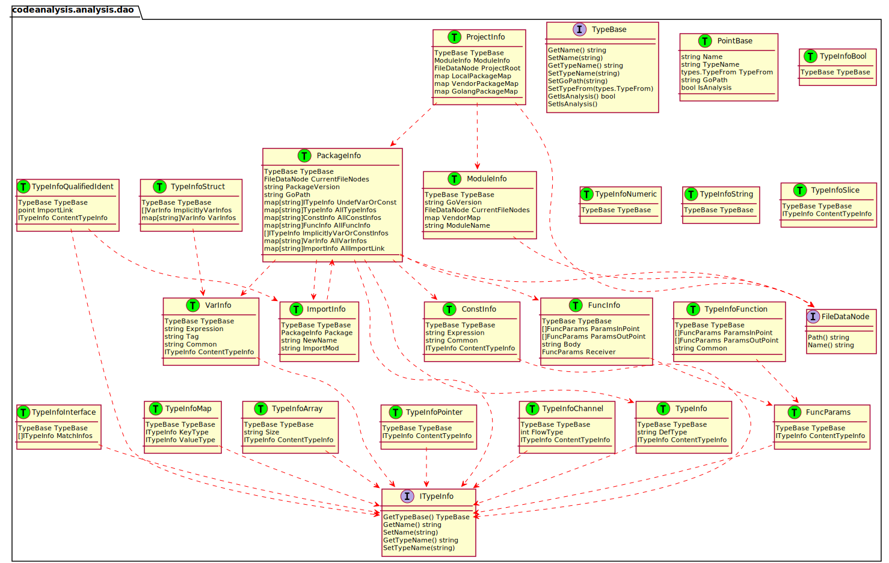
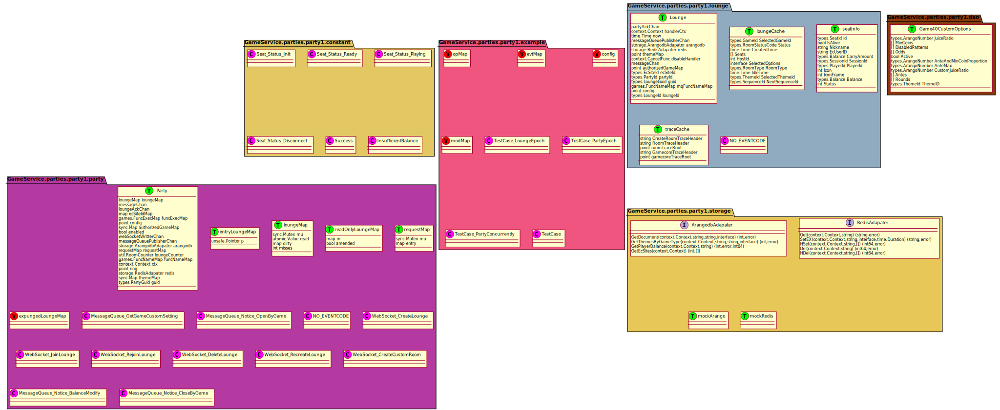
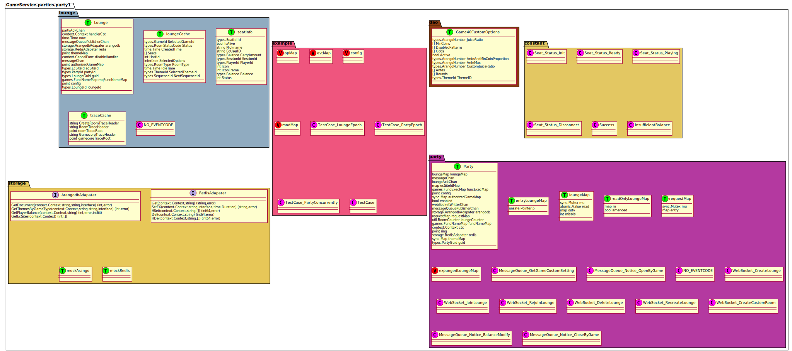
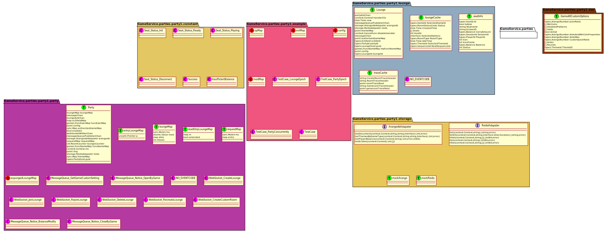
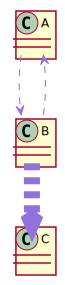

# 靜態分析

## 專案載入
解析前製作業

### 專案載入流程
載入時使用的讀取方式與如何實做排除特定檔案

> goloader.go 檔案讀取實做

```
func LoadRoot(rootPath string) *GoFileNode {
	rootNode := newNode(rootPath, nil)

	option := Option{
		MaxDepth: 0,
		SkipFile: []string{".vscode", ".git", "vendor"},
	}
	rootNode.Childes = loopBuildStruct(rootNode, 0, option)
	return rootNode
}

func loopBuildStruct(node *GoFileNode, depth int, option Option) []*GoFileNode {
	var nodeChilds []*GoFileNode

	// 檔案深度遞增
	depth++
	files, _ := ioutil.ReadDir(node.path)

	// 建立子檔案節點
	for _, file := range files {
		isSkip := false
		for _, skipFile := range option.SkipFile {
			if skipFile == file.Name() {
				isSkip = true
			}
		}
		if isSkip {
			continue
		}

		// 建立檔案節點
		newPath := filepath.Join(node.path, file.Name())
		newNode := newNode(newPath, file)
		nodeChilds = append(nodeChilds, newNode)

		// 取得子節點的 子節點
		newNode.Childes = loopBuildStruct(newNode, depth, option)
	}

	return nodeChilds
}
```

### 資料結構
個別結構功能來源簡述

```
type ProjectInfo struct {
	TypeBase         `json:"-"`
	ModuleInfo       *ModuleInfo             `json:"-"`
	ProjectRoot      FileDataNode            `json:"-"`
	LocalPackageMap  map[string]*PackageInfo // 內部實做 package <packagePath, *PackageInfo>
	VendorPackageMap map[string]*PackageInfo `json:"-"` // 外部引用 package <packagePath, *PackageInfo>
	GolangPackageMap map[string]*PackageInfo `json:"-"` // 系統自帶 package <packagePath, *PackageInfo>
}

type PackageInfo struct {
	TypeBase
	PackageVersion   string
	GoPath           string
	CurrentFileNodes FileDataNode `json:"-"`

	UndefVarOrConst           map[string]ITypeInfo
	ImplicitlyVarOrConstInfos []ITypeInfo // 隱藏式宣告參數 var or const
	AllTypeInfos              map[string]*TypeInfo
	AllVarInfos               map[string]*VarInfo
	AllConstInfos             map[string]*ConstInfo
	AllFuncInfo               map[string]*FuncInfo
	AllImportLink             map[string]*ImportInfo // <path, *ImportInfo>
}

type VarInfo struct {
	TypeBase
	ContentTypeInfo ITypeInfo
	Expression      *Expression
	Tag             string
	Common          string
}

type FuncInfo struct {
	TypeBase
	Receiver       FuncParams   // 篩選器
	ParamsInPoint  []FuncParams // 輸入參數
	ParamsOutPoint []FuncParams // 輸出參數
	Body           string       `json:"-"` // 方法內文 *尚未解析
}

type Expression struct {
	ExpressionType ITypeInfo // 表達式最終類型
	ContentStr     string

	SubExpression []Expression // 子表達式
	Operators     string       // 操作符號
	PrimaryExpr   *PrimaryExpr // 初級表達式
}
```

## 語言分析
官方文件使用方式與程式碼分析流程

### 官方文件
| Column 1 | Column 2                        |
| -------- |:------------------------------- |
| \|       | alternation 交替                |
| ()       | grouping    分組                |
| []       | option      選項 (0 or 1 times) |
| {}       | repetition  重複 (0 to n times) |


### 關鍵字解析

[Packages 檔案格式](https://go.dev/ref/spec#Packages)

[Declarations and scope 宣告範圍格式](https://go.dev/ref/spec#Declarations_and_scope)

| TopLevelDecl                                              | Note |
|:--------------------------------------------------------- | ---- |
| [Constant](https://go.dev/ref/spec#Constant_declarations) |      |
| [Var](https://go.dev/ref/spec#VarDecl)                    |      |
| [Type](https://go.dev/ref/spec#Type)                      |      |
| [Function](https://go.dev/ref/spec#Function_declarations) |      |
| [Method](https://go.dev/ref/spec#Method_declarations)     |      |


```
_package main

import ""
import (
        ""
        _ ""
        . ""
        name ""
)

var VarName Type
var VarName = exp

const ConstName Type
const ConstName = exp

func FuncName(){}

```

### 資料型態解析
#### TypeDecl


| Types                                                | Note |
|:---------------------------------------------------- | ---- |
| [Boolean](https://go.dev/ref/spec#Boolean_types)     |      |
| [Numeric](https://go.dev/ref/spec#Numeric_types)     |      |
| [String](https://go.dev/ref/spec#String_types)       |      |
| [Array](https://go.dev/ref/spec#Array_types)         |      |
| [Slice](https://go.dev/ref/spec#Slice_types)         |      |
| [Struct](https://go.dev/ref/spec#Struct_types)       |      |
| [Pointer](https://go.dev/ref/spec#Pointer_types)     |      |
| [Function](https://go.dev/ref/spec#Function_types)   |      |
| [Interface](https://go.dev/ref/spec#Interface_types) |      |
| [Map](https://go.dev/ref/spec#Map_types)             |      |
| [Channel](https://go.dev/ref/spec#Channel_types)     |      |
| [Qualified](https://go.dev/ref/spec#QualifiedIdent)  |  並非類型而是一種標示方式    |


### 建立關聯索引
ProjectInfo 關聯圖形



## 第二階段語言分析
表達式解析流程

### 表達式解析


## 圖形化
ProjectInfo 匯入
### Plantuml 生成

```
NameSpace PathName{
	
    interface FuncName{
        MethodName(params) params
    }

    class VarName{
        type Name
    }

	class ConstName{
        type Name
    }
}
...


Line (NameSpace + Class --> NameSpace + Class options)
...
```

#### plantuml 格式使用


<H4>NameSpace</H4>
```
GameService.parties.party1.constant
GameService.parties.party1.dao
GameService.parties.party1.example
GameService.parties.party1.lounge
GameService.parties.party1.party
GameService.parties.party1.storage
```



```
GameService.parties.party1
GameService.parties.party1.constant
GameService.parties.party1.dao
GameService.parties.party1.example
GameService.parties.party1.lounge
GameService.parties.party1.party
GameService.parties.party1.storage
```



> 群組無法跨兩層

```
GameService.parties
GameService.parties.party1.constant
GameService.parties.party1.dao
GameService.parties.party1.example
GameService.parties.party1.lounge
GameService.parties.party1.party
GameService.parties.party1.storage
```



<H4>Line</H4>

> 選項在句尾無法調整線寬 建議放在中間
```
A --> B #9072dd;line.dashed;
B -[#9072dd,dashed]-> A 
B -[#9072dd,dashed,thickness=16]-> C
```




## Ref

golang 編碼格式

[https://go.dev/ref/spec](https://go.dev/ref/spec)

go.mod 

說明後面版本與格式的定義

gopkg.in/yaml.v2, github.com/go-redis/redis/v8

[https://go.dev/ref/mod#major-version-suffixes](https://go.dev/ref/mod#major-version-suffixes)